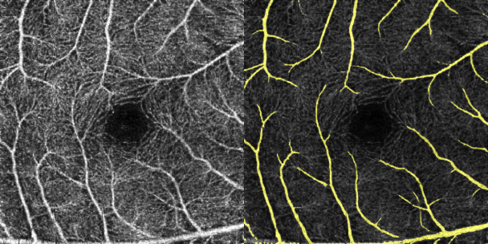
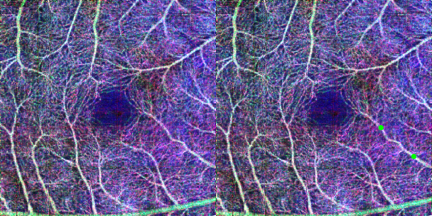

# SAM-OCTA

## 1.快速上手

这是一个使用 LoRA 对 SAM 进行微调，并在 OCTA 图像上执行分割任务的项目, 使用 **PyTorch** 构建。

首先，您应该将一个预训练的权重文件放入 **sam_weights** 文件夹中。预训练权重的下载链接如下:

vit_h (default): https://dl.fbaipublicfiles.com/segment_anything/sam_vit_h_4b8939.pth 

vit_l: https://dl.fbaipublicfiles.com/segment_anything/sam_vit_l_0b3195.pth

vit_b: https://dl.fbaipublicfiles.com/segment_anything/sam_vit_b_01ec64.pth

经过测试，三种模型所需要的显存分别为：**36,248、 26,154、 13,467** MB。其中vit_h是默认使用的，如果您需要使用其他更小的模型，请下载对应权重，并修改对应配置项。

    ...
    parser.add_argument("-model_type", type=str, default="vit_h")
    ...

使用 **train_sam_octa.py** 来开始进行微调。警告信息将指导您应该去安装哪些包。这些包都是常用的python库，不需要额外的配置。

    python train_sam_octa.py

数据集应该按照 OCTA-500 的形式组织，就像这样：

    /datasets
        /OCTA-500
            /OCTA_3M
                /GT_Artery
                    10301.bmp
                    10302.bmp
                    ...
                /GT_Capillary
                    10301.bmp
                    10302.bmp
                    ...
                /GT_FAZ
                ...
                /ProjectionMaps
                    /OCTA(FULL)
                        10301.bmp
                        10302.bmp
                        ...
                    /OCTA(ILM_OPL)
                        10301.bmp
                        10302.bmp
                        ...
                    /OCTA(OPL_BM)
                        10301.bmp
                        10302.bmp
                        ...
            /OCTA_6M
                ...

这里我使用了 **OCTA_500** 中 FoV (视场角) 为 3M 的id为10301样本作为一个示例，如果需要完整的数据集，需要联系 **OCTA_500** 数据集的作者。

**OCTA-500**'s related paper: https://arxiv.org/abs/2012.07261

示例结果和分割指标将被记录在 **results** 文件夹中（如果不存在，则这个文件夹将被自动创建）。

如果您需要对预测结果进行可视化，请使用 **display.py** 文件。由于结果文件夹是按时间生成的，需要对这一行代码进行替换。生成的图像存放在 **sample_display** 文件夹中。

    ...
        test_dir = "results/2024-01-01-08-17-09/3M_LargeVessel_100_True/0/0000" # Your result dir
    ...

这是一些带有提示点的分割的示例，从左到右分别是输入图像、标注以及预测结果。

**局部模式**

*动脉*

*中心无血管区*

**全局模式**

*视网膜血管*

*毛细血管*

## 2.相关配置

该项目能够支持多个分割任务，并且分为**全局**和**局部**两种模式。事实上，全局模式下的性能与其他分割模型相差无几，局部模式则是SAM-OCTA所独有。在 **options.py** 文件中，可以对其进行配置，以下是各个选项的说明：

* -device：指定可用显卡的id，可以支持多张显卡，但是由于Meta代码实现的原因，batch_size应该和所使用的显卡数量一致。然而又因为dataloader需要把不同样本对齐，所以最好是 **batch_size=1** 地进行训练，以避免提示点的长度对不齐所造成的报错。
* -epochs: 训练多少轮。
* -lr: 由于采用了warm-up策略，这里指的是最大学习率。
* -check_interval: 间隔多少轮训练后保存一次结果（包括权重）。
* -k_fold：k折交叉验证。
* -prompt_positive_num：正提示点数量，-1为随机。
* -prompt_total_num： 总提示点数量，-1为随机。
* -model_type: 选择SAM的训练模型："vit_h", "vit_l" 以及 "vit_b"。
* -is_local: 是否为局部模式。
* -remark: 一些你需要填写的备注信息，会添加到生成的结果文件夹名中。

以下是针对 **OCTA-500** 数据集的一些配置：
* -fov: 选择视场角对应的子数据集。
* -label_type: 选择标注类型（分割任务类型）:"LargeVessel", "FAZ", "Capillary", "Artery" 以及 "Vein"。
* -metrics: 选择需要统计的指标(可多选): "Dice", "Jaccard", "Hausdorff"

## 3.其他

如果觉得有用请引用相关论文: https://arxiv.org/abs/2309.11758

**预训练权重(百度网盘)**: 

链接：https://pan.baidu.com/s/1S43QadZlhT8dL8TPbA0N6g?pwd=sifh 

提取码：sifh 

## 4.实例预测（补充）

这里我添加一份关于血管的预测代码，并结合图文给出相关说明。

1. 首先准备一张你要预测的图片，我在代码中的处理是将三个通道叠加后，再并排复制一份。复制的一份是用来方便手动标记提示点的（纯绿色正点，纯红色负点），总之就像这样。

2. 然后加载这个权重，由于只是示例，所以我直接使用了vit-l来微调，花费时间短且内存占用少些。并且这个权重结合了全局和局部两种模式。权重下载链接为：

https://pan.baidu.com/s/1iCVmPaLOWVk36YbgcQ4AOg?pwd=i54c 提取码: i54c 

然后运行 __predict.py__，结果保存在一个自动生成的 __predition__ 的文件夹中。

3. 全局模式下，无需提供提示点，我在代码中自动加了一个[-100, -100]的固定负点，让我们看看分割效果：

4. 局部模式下，在血管上给出提示点，例如：

对应效果如图：

